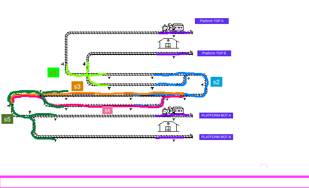

# Lab 1 – Train Control System Documentation

## High-Level Design

Our program controls two trains moving on the provided TSim track.  
The trains share critical track segments, so we use semaphores to enforce mutual exclusion: only one train may occupy a critical section at a time.  
Each train listens for sensor events to decide when to enter or leave sections, switch tracks, or stop at stations.

The solution guarantees:
- No collisions between trains.
- Correct switching at junctions and merges/splits.
- Fair use of shared sections.
- Proper stopping and turnaround at station platforms.

---

## Placement of Sensors

We rely on the built-in sensors placed along the TSim track.  
Each ACTIVE sensor event indicates when a train is entering or leaving a critical section.  
We use them as entry and exit points for track sections and stations:

- **Section 1 (left vertical):** Sensors at (6,6), (8,6), (10,7), (10,8).  
- **Section 2 (right junction):** Sensors at (14,7), (14,8), (12,9), (12,10).  
- **Section 3 & 4 (parallel middle lanes):** Entry at (17,9), exit at (1,10).  
- **Section 5 (left junction):** Sensors at (6,9), (6,10), (5,11), (5,13).  
- **Stations:** Stopping sensors at (16,3), (16,5), (16,11), (16,13).  
- **Station reservations:** Before reaching a station, the trains use **(19,8) when going UP** and **(1,10) when going DOWN** to claim one of the available platforms. This guarantees that a train will never enter a station if both platforms are already occupied.

---

## Choice of Critical Sections

We divided the track into 5 main critical sections plus the station platforms:

1. **Section 1 – Left vertical**  
   Shared track near the top-left connector.  
2. **Section 2 – Right junction**  
   Shared track around the (17,7) and (15,9) switches.  
3. **Section 3 – Top middle lane**  
   First option in the parallel middle part.  
4. **Section 4 – Bottom middle lane**  
   Second option in the parallel middle part.  
5. **Section 5 – Left junction**  
   Shared track around the (4,9) and (3,11) switches.  
6. **Station platforms**  
   Each station has two platforms guarded by their own semaphores. Platforms are reserved at approach sensors (19,8 for top station, 1,10 for bottom station).

This division ensures that only one train occupies each critical piece of track or platform at a time.

---

## Maximum Train Speed

We determined the maximum safe speed for our solution to be **20 units**.

- Up to speed 20, the trains:
  - Stop correctly at stations.  
  - Enter and leave sections safely.  
  - Follow switch settings without derailing.  
- At speeds **above 20**, the trains may overshoot stations.  

Since the assignment specifies that trains will be run at speeds up to **15**, our solution is safe within the requirements, with extra margin.

---

## Testing

We tested our program by running both trains at multiple speed combinations, including:

- Slow vs. slow (e.g., 10 and 12).  
- Slow vs. fast (e.g., 10 and 20).  
- Fast vs. fast (e.g., 18 and 20).  

During testing we checked:
- That trains never collide in shared sections.  
- That trains always stop and reverse correctly at all four station platforms.  
- That trains correctly reserve a station before entering (using sensors at 19,8 and 1,10).  
- That switches are set correctly depending on the direction of travel.

Through repeated trials, we verified that the solution works reliably within the assignment’s requirements.

---

## Conclusion

Our implementation guarantees safety by combining:
- Semaphore-protected critical sections and station platforms.  
- Sensor-based entry and exit logic.  
- Reservation of platforms before a train enters a station.  
- Proper direction handling and turnaround at platforms.  

The result is a correct and robust solution for the TSim train control assignment.
